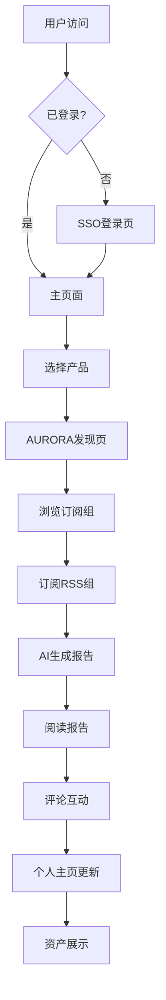

## 1. 产品概述
PEGASUS是新时代的社交一站式平台，采用"万物皆资产"理念，为用户提供统一的单点登录网关和精美的Apple风格界面。AURORA作为首个子产品，是AI驱动的信息提炼平台，通过RSS聚合和AI总结帮助用户突破信息茧房。

目标用户：追求高效信息获取的知识工作者、AI技术爱好者、内容创作者。市场价值：重新定义信息消费方式，打造去中心化的知识资产社交生态。

## 2. 核心功能

### 2.1 用户角色
| 角色 | 注册方式 | 核心权限 |
|------|----------|----------|
| 普通用户 | 邮箱/手机号注册 | 浏览内容、订阅RSS、生成报告、社交互动 |
| 高级用户 | 邀请制/付费升级 | 发布订阅组、创建群组、高级AI功能 |
| 管理员 | 系统分配 | 内容审核、用户管理、系统配置 |

### 2.2 功能模块
PEGASUS平台包含以下核心页面：
1. **主页面**：Apple风格的统一入口，产品导航、用户登录、资产展示。
2. **个人主页**：用户信息、资产墙、社交关系展示。
3. **社交中心**：关注流、群组聊天、好友管理。

AURORA子产品包含以下核心页面：
1. **发现页**：热门订阅组、推荐内容、搜索功能。
2. **订阅管理页**：RSS源管理、订阅组创建、OPML导入导出。
3. **报告阅读页**：AI生成的日报/周报/月报展示、评论标注。
4. **个人订阅页**：我的订阅组、生成的报告历史。

### 2.3 页面详情
| 页面名称 | 模块名称 | 功能描述 |
|----------|----------|----------|
| 主页面 | 导航栏 | 显示平台Logo、用户头像、产品切换菜单、登录状态 |
| 主页面 | Hero区域 | 全屏展示平台理念、动态背景、核心产品介绍 |
| 主页面 | 产品矩阵 | 卡片式展示各子产品入口、使用统计、最新动态 |
| 个人主页 | 资产墙 | 可视化展示用户拥有的订阅组、报告、社交勋章 |
| 个人主页 | 社交统计 | 关注数、粉丝数、获赞数、资产价值 |
| 发现页 | 热门订阅组 | 基于用户行为推荐优质订阅组、支持筛选排序 |
| 发现页 | 推荐报告 | 展示高质量的AI生成报告、支持预览和收藏 |
| 订阅管理页 | RSS源列表 | 显示已订阅的RSS源、支持批量操作和分组管理 |
| 订阅管理页 | 订阅组编辑器 | 拖拽式创建订阅组、设置公开/私有权限 |
| 报告阅读页 | AI摘要展示 | 清晰展示文章核心观点、关键信息提取 |
| 报告阅读页 | 评论区 | 支持对报告进行评论、点赞、分享 |
| 个人订阅页 | 我的报告 | 时间轴展示生成的报告、支持搜索和筛选 |

## 3. 核心流程

### 用户注册登录流程
用户访问主页面 → 点击登录 → SSO网关验证 → 选择注册方式 → 完善个人信息 → 进入平台

### AURORA信息提炼流程
用户创建订阅组 → 系统定时拉取RSS → 单源去重 → AI单篇总结 → 聚合生成报告 → 翻译 → 用户阅读

### 社交互动流程
浏览内容 → 关注用户/订阅组 → 生成个人Feed流 → 评论互动 → 建立群组 → 实时聊天

## 4. 用户界面设计

### 4.1 设计风格
- **主色调**：纯黑(#000000)与纯白(#FFFFFF)的极致对比
- **辅助色**：少量渐变蓝(#007AFF到#5856D6)作为点缀
- **按钮风格**：圆角矩形，悬浮时有微妙阴影变化
- **字体**：系统默认无衬线字体(San Francisco/PingFang SC)
- **布局**：卡片式布局，大量留白，非对称设计
- **图标**：线性图标，统一2px线宽，圆角处理

### 4.2 页面设计概述
| 页面名称 | 模块名称 | UI元素 |
|----------|----------|--------|
| 主页面 | Hero区域 | 全屏视频背景，中心文字动画，底部指示器 |
| 主页面 | 产品卡片 | 圆角卡片设计，悬浮放大效果，毛玻璃背景 |
| 个人主页 | 资产墙 | 瀑布流布局，卡片hover效果，加载动画 |
| 发现页 | 订阅组卡片 | 封面图+标题+描述+统计信息，网格布局 |
| 报告阅读页 | 内容区 | 大字号标题，清晰分段，关键信息高亮 |
| 订阅管理页 | 编辑器 | 拖拽排序，实时预览，批量操作 |

### 4.3 响应式设计
- **桌面优先**：优先设计1440px以上宽度的桌面端体验
- **移动端适配**：768px以下采用单列布局，手势优化
- **触摸交互**：支持滑动、捏合、长按等手势操作
- **性能优化**：图片懒加载，虚拟滚动，骨架屏

### 4.4 扩展性设计
- **组件化**：所有UI组件可复用，支持主题切换
- **动画系统**：统一的缓动函数，支持性能优化
- **无障碍**：支持屏幕阅读器，键盘导航，高对比度模式